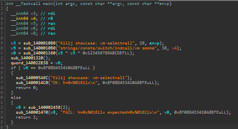
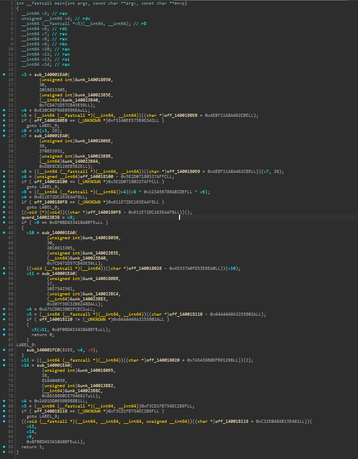
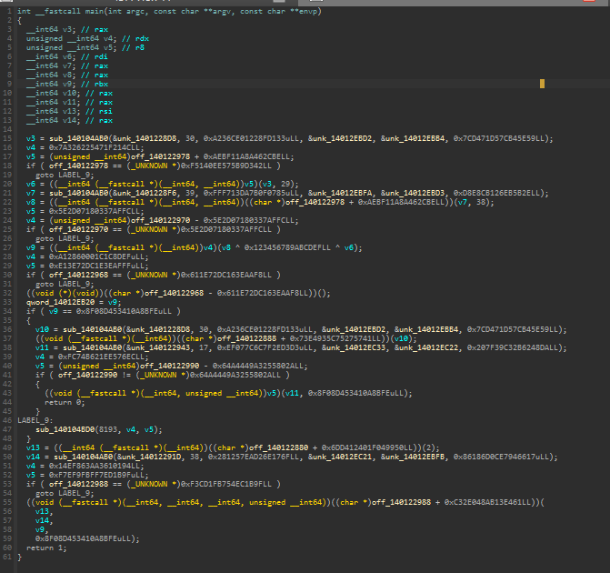
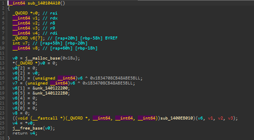

# Kilij


A ~25,000-line C++17 code obfuscation framework for LLVM 20. Twelve composable
IR-level transforms and a custom bytecode virtual machine, usable as a drop-in
Clang pass plugin (`Kilij.{so|dll}`) or baked into a full toolchain build.

The centerpiece is the VM: it translates function bodies into a custom ISA
(17 opcodes, 8 type kinds, register-file model), emits bytecode, and generates
a per-module interpreter entirely in LLVM IR. Three encoding layers (affine,
MBA, Feistel) and layout hardening make the bytecode non-trivial to lift back.

## Platform support

| Platform | Status | Notes |
|---|---|---|
| Windows x86\_64 | Full support | All 12 transforms + VM; IAT obfuscation and extern hiding are Windows-only; prebuilt binaries available |
| Linux x86\_64 | Builds, untested | All 12 transforms + VM; no prebuilt binaries yet; behavior not guaranteed |
| Windows ARM64 | Partial | IAT obfuscation disabled (x64 PEB walk) |
| Other | Untested | Core IR passes are target-independent; VM/IAT may need porting |

## Comparison

| Feature | O-LLVM | Hikari | Pluto | Polaris | Kilij |
|---------|:------:|:------:|:-----:|:-------:|:-----:|
| Flattening | Y | Y | Y | Y | Y |
| Bogus CFG | Y | Y | Y | Y | Y |
| Substitution | Y | Y | Y | Y | Y |
| MBA | Partial | | Y | Y | Y |
| String encryption | | Y | Y | Y | Y |
| Split blocks | Y | Y | Y | | Y |
| Constant encryption | | | Y | Partial | Y |
| Indirect branches | | Y | | Y | Y |
| Indirect calls | | Y | Y | Y | Y |
| Opaque predicates | | | | | Y |
| VM virtualization | | | | | Y |
| IAT obfuscation | | | | | Y |
| **LLVM version** | 4 | 8 | 14 | 16 | **20** |

Y = supported, Partial = limited

## What it looks like

`main()` from the showcase binary at four levels, decompiled in IDA:

| Unobfuscated | Passes only |
|:---:|:---:|
|  |  |

| Passes + VM (`vm-select=all`) | VM dispatch loop |
|:---:|:---:|
|  |  |

## Architecture

```
Plugin.cpp                     pass registration (OptimizerLastEPCallback)
 |
 +-- VM/                       bytecode virtual machine (~15k lines)
 |    +-- VMPass.cpp            entry point, function selection
 |    +-- VMIR.cpp              VM IR types, printing, and helpers
 |    +-- VMBytecode.cpp        VM IR -> bytecode emission
 |    +-- VMInterpreter.cpp     VM IR executor for differential testing
 |    +-- VMEncode.cpp          affine / MBA / Feistel encoding
 |    +-- VMEmitInterp.cpp      opcode-mode interpreter (~3,800 lines)
 |    +-- VMEmitRegion.cpp      region-mode emission
 |    +-- VMLowering.cpp        LLVM IR -> VM IR lowering
 |    +-- VMRegionFormation.cpp region selection
 |
 +-- Flattening.cpp            switch-based CFG dispatch (Feistel-encoded)
 +-- BogusControlFlow.cpp      opaque conditional branches + junk clones
 +-- SplitBasicBlock.cpp       basic block fragmentation
 +-- MBAObfuscation.cpp        mixed boolean-arithmetic rewrites
 +-- Substitution.cpp          arithmetic replacement with canceling constants
 +-- IndirectBranch.cpp        XOR-encoded branch/call tables, split keys, decoys
 +-- StringObfuscation.cpp     XOR-shift stream cipher, FNV-1a verify, atomic CAS
 +-- ConstObfuscation.cpp      volatile global key + rotate XOR
 +-- OpaquePredicates.cpp      7 families: DiffSquares, XorEq, Powmod, Collatz, MinorQuadric, QSeries, Composite
 +-- IATObfuscation.cpp        PEB walk + export scan (Windows x64)
 +-- CryptoUtils.cpp           AES-CTR PRNG, FNV-1a, modular inverse
 +-- Utils.cpp                 annotations, skip logic, growth budgets
```

## Docs

- [Getting started](#getting-started)
- [Building from source](#building-from-source)
- [All flags and passes](docs/PASSES.md)
- [VM architecture and modes](docs/VM.md)
- [Detailed build instructions](docs/BUILDING.md)
- [Troubleshooting](docs/TROUBLESHOOTING.md)
- [Contributing](CONTRIBUTING.md)

## Features

**Control flow (4 passes):**
flattening, bogus control flow, block splitting, indirect branches

**Data flow (4 passes):**
MBA, substitution, constant encryption, string encryption

**Call/import obfuscation (3 passes):**
indirect calls (table + split-key + decoys), IAT obfuscation (thunk or
PEB-resolver backend), extern hiding

**Opaque predicates (7 families):**
DiffSquares (algebraic identity), XorEq, Powmod (Fermat's Little Theorem),
Collatz (bounded conjecture), MinorQuadric, QSeries, Composite -- salted
with `readcyclecounter` + FNV

**VM virtualization:**
custom ISA, three execution modes (opcode / basic-block / region), three
encoding layers (affine / MBA / Feistel), bytecode layout hardening
(shuffled fields, randomized stride, rotated+XOR'd 8-bit fields),
encoded PC, indirect dispatch, bogus handlers, per-module state shuffling

## Prerequisites

- **CMake** >= 3.20
- **Ninja** (recommended) or Make
- **LLVM 20** development headers (only for standalone plugin builds)
- **Python 3** (for running tests only)

Windows toolchain builds also require Visual Studio Build Tools with MSVC x64.

## Getting started

All flags are passed as `-mllvm -<flag>`. Full list: [`docs/PASSES.md`](docs/PASSES.md)
(or `clang -mllvm -help`).

### Quick start with prebuilt toolchain

Download `kilij-clang20-win64.zip` from
[GitHub Releases](https://github.com/dannyisbad/kilij/releases) and extract it.
Linux binaries are not yet available; build from source instead (see below).

The zip contains:

```
kilij-clang20-win64/
  bin/            clang.exe, opt.exe, Kilij.dll, lld-link.exe, llvm-as/dis/objdump
  lib/            runtime libraries
  examples/       smoke test inputs (_tmp_kilij_smoke.c, .ll)
  quickstart/     verification scripts
```

Run the showcase script to build and run a small C++ program at four
obfuscation levels (unobfuscated, passes-only, VM-only, full). Requires
Visual Studio Build Tools for MSVC headers/libs:

```bat
quickstart\build_showcase_exe.bat
```

This produces four executables under `quickstart\out\showcase\` and runs
each one to confirm correctness. To verify the lower-level toolchain
pieces individually:

```bat
quickstart\run_clang_obf_ir.bat    &REM clang with obfuscation flags
quickstart\run_opt_plugin.bat      &REM opt loading Kilij.dll
```

Then use the extracted clang directly on your own code:

```bat
bin\clang.exe -O2 foo.cpp -o foo.exe -mllvm -fla -mllvm -bcf
```

`-fpass-plugin` is not needed -- passes are linked into this clang.

### Build the plugin (recommended for development)

Build the standalone out-of-tree pass plugin against an existing LLVM 20
installation. This is the fastest way to iterate on the passes.

```bash
cmake -S . -B build -G Ninja \
  -DLLVM_DIR=/path/to/llvm/lib/cmake/llvm
ninja -C build Kilij
```

This produces `Kilij.so` (Linux) or `Kilij.dll` (Windows). Use it with any
LLVM 20 clang:

```bash
clang++ -O2 foo.cpp -o foo \
  -fpass-plugin=./build/lib/Kilij.so \
  -mllvm -fla -mllvm -bcf
```

Or via `opt` (IR in / IR out):

```bash
opt -load-pass-plugin=./build/lib/Kilij.so \
  -passes='fla,bcf' \
  -S in.ll -o out.ll
```

Windows note: the standalone `Kilij.dll` is built to import symbols from the
included `opt.exe` (static plugin model). Use it via `opt -load-pass-plugin=...`
or use the prebuilt clang (passes baked in).

### Build complete toolchain from source

Build a full clang/opt/lld toolchain with Kilij baked in. The release scripts
clone LLVM 20.1.0, copy Kilij into the tree, apply patches, and build
everything.

**Linux:**
```bash
bash release/build_linux.sh
```

**Windows** (from a PowerShell prompt):
```powershell
powershell -ExecutionPolicy Bypass -File release\build_windows.ps1
```

The scripts produce a packaged release archive under `_release_out/`. You can
customize the LLVM source directory, build directory, and job count via
environment variables (Linux) or parameters (Windows). See
[`docs/BUILDING.md`](docs/BUILDING.md) for full details.

## Verify it works

After building, run a quick smoke test to confirm the plugin loads and
transforms code:

```bash
# Write a minimal test file
echo 'int foo(int x) { return x * 2 + 1; }' > /tmp/test.c

# Run with flattening enabled (standalone plugin)
clang -O2 -fpass-plugin=./build/lib/Kilij.so \
  -mllvm -fla -c /tmp/test.c -o /tmp/test.o

# Or with the full toolchain build
./bin/clang -O2 -mllvm -fla -c /tmp/test.c -o /tmp/test.o
```

If it compiles without errors, the plugin is working. Add `-mllvm -obf-verify`
for extra safety (runs the LLVM verifier after every transform).

### Quick configs

```text
# light
-mllvm -fla -mllvm -bcf -mllvm -mba -mllvm -split

# vm
-mllvm -vm-mode=opcode -mllvm -vm-encode=mba -mllvm -vm-select=all

# windows iat (safe default, keeps imports)
-mllvm -obf-iat -mllvm -obf-iat-backend=thunk
```

If you're turning on lots of transforms at once while bringing up a new target,
add `-mllvm -obf-verify` (and optionally `-mllvm -obf-dump-ir`).

For reproducible builds, set `-mllvm -obf-seed=<N>`.

## Building from source

If you want to modify the passes or build for a different target.

**Full toolchain build + packaging (recommended):**

- Windows: `release/build_windows.ps1`
- Linux (WSL/Linux): `release/build_linux.sh`

These scripts pin an LLVM commit, copy Kilij into `llvm/lib/Transforms/Obfuscation`,
build `clang/opt/lld` + the `Kilij` pass plugin, then package release archives.

**Standalone plugin (faster, needs existing LLVM 20):**

```bash
cmake -S . -B build-obf -G Ninja \
  -DLLVM_DIR=/path/to/llvm/lib/cmake/llvm
ninja -C build-obf Kilij
```

More details: [`docs/BUILDING.md`](docs/BUILDING.md).

## Configuration notes

Enable a small set of transforms and iterate. If you turn on many passes at
once, use `-obf-verify` (and optionally `-obf-dump-ir`) while you bring up
targets.

### Passes

Flags are always `-mllvm -<flag>`.

- Flattening: `-fla`
- Bogus CFG: `-bcf` (`-bcf_loop`, `-bcf_prob`)
- Split: `-split`
- MBA: `-mba`
- Substitution: `-sub`
- Indirect calls: `-indcall`
- Indirect branches: `-indbr`
- String obfuscation: `-obf-str`
- Constant obfuscation: `-obf-const`
- Opaque predicates: `-opaque-pred-rate=0-100` (per-family weights: `-opaque-pred-w-diffsq`, `-opaque-pred-w-xoreq`, etc.)
- IAT obfuscation (Windows): `-obf-iat`
- Extern hiding (Windows): `-obf-hide-externs`
- VM: `-vm-mode=...`

### Coverage notes

- `-vm-select=all` means all **eligible** functions. VM skips unsupported IR
  (EH/`invoke`, `callbr`, `musttail`, inline asm, dynamic alloca, >64-bit ints).
  Use `-vm-report=<file>` to write a selection report showing why each function was skipped or virtualized.
- VM security differs by mode: `opcode` is strongest, `bb` is medium, `region` is
  speed-first and easier to analyze. Use `opcode` for security-critical code.
- IAT obfuscation is Windows x64 only (disabled on Windows ARM64 and non-Windows).
- `-obf-hide-externs` uses in-place call rewrites to stay EH-safe.
- `-vm-hard-rt` anti-debug/integrity checks are Windows-only (no-ops elsewhere).

## Function selection

We skip `DllMain`, CRT entrypoints, global init helpers, and `optnone` functions.
Use `annotate("fla")` / `annotate("nofla")` to opt in/out per function.
`-obf-only-annotated` restricts function passes that use `toObfuscate` to
annotated functions only (module passes have their own selection rules).
`-obf-symbols=false` keeps helper symbols readable for debugging.

```cpp
#define OBF(x) __attribute__((annotate(x)))

OBF("fla") void Foo();
OBF("nofla") void Bar();
OBF("no_obfuscate") void Sensitive();
```

## Testing

Three levels of testing:

**Unit tests and IR fuzzer** (`kilij-tests/unit_fuzz_run.py`):

- **Unit tests** check annotation selection, edge cases (musttail, callbr,
  indirectbr, MSVC EH), smoke tests for each pass, and platform quirks
  (UEFI, i686 stdcall).
- **IR fuzzer** feeds random `llvm-stress` output through every pass config
  with `-obf-verify` and looks for crashes.

```bash
python3 kilij-tests/unit_fuzz_run.py unit
python3 kilij-tests/unit_fuzz_run.py fuzz
python3 kilij-tests/unit_fuzz_run.py all
```

**End-to-end project builds** (`kilij-tests/e2e_run.py`):

Builds four real open-source projects (fmt, zstd, libuv, yaml-cpp) with full
obfuscation (`vm-select=all`, all passes on) and runs their test suites.

```bash
python3 kilij-tests/e2e_run.py --toolchain-bin path/to/kilij/bin
```

`-obf-verify` (on by default) runs the LLVM verifier after every transform.
`-vm-validate` does differential testing: clones the function, runs both
native and VM, traps on mismatch.

See [`kilij-tests/README.md`](kilij-tests/README.md) and
[`kilij-tests/README.md`](kilij-tests/README.md).

## License

UIUC/NCSA (Obfuscator-LLVM). See `LICENSE`.
